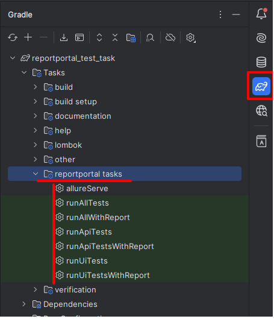

[тестовое задание](info/ТестовоеЗадание_AQA_Java_.pdf)

В списке виджетов не было типа "Task Progress" (ui тест)
добавил рандомный.

Проект автоматизации API и UI тестов для ReportPortal.  
Используются:

- Java 17
- JUnit 5
- RestAssured
- Allure
- Gradle

Запуск тестов через меню задач в gradle

Запуск всех тестов и генерация Allure отчёта

`./gradlew runAllWithReport`

Запуск только API тестов (@Tag("api"))

`./gradlew runApiTests`

Запуск только API тестов с Allure отчётом

`./gradlew runApiTestsWithReport`

Запуск только UI тестов / с Allure отчётом

`./gradlew runUiTests`

`./gradlew runUiTestsWithReport`

Генерация Allure отчёта вручную

`./gradlew allureReport`